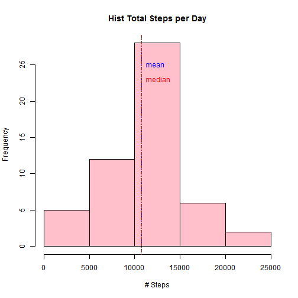
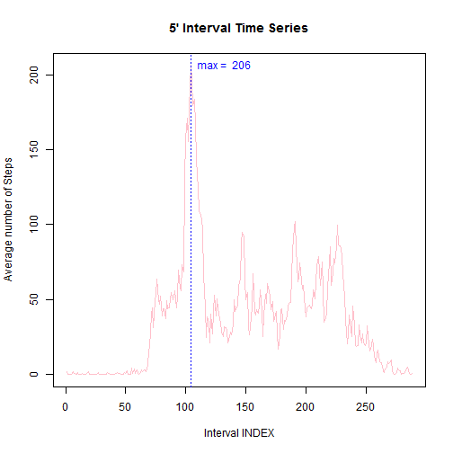
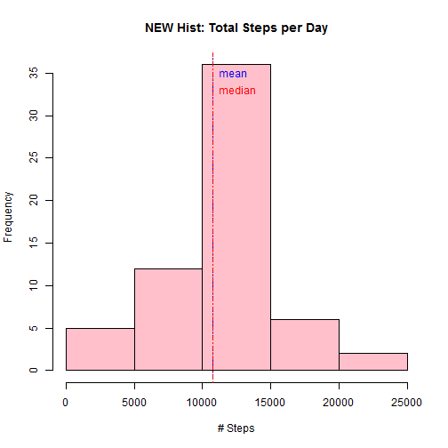
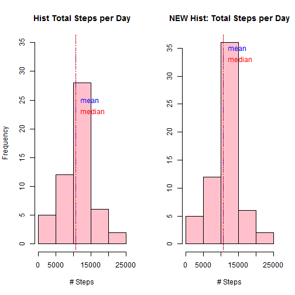
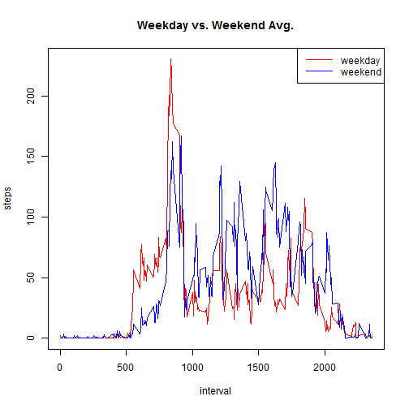

## Loading and preprocessing the data


```r
# build a subset of the complete values
data <- read.csv(unz("activity.zip","activity.csv"),colClasses=c("integer","Date","integer"))
completes<-subset(data,complete.cases(data)==TRUE)              

#split by date and aggregate
splitByDay<-split(completes,completes$date, drop=TRUE)            
dailySteps<-sapply(splitByDay, function(x) sum(x$steps))        

# plot a histogram
hist(dailySteps, main="Hist Total Steps per Day", xlab="# Steps", col="pink") 

#show mean and median
abline(v=mean(dailySteps), lty=3, col="blue")                     
abline(v=median(dailySteps), lty=4, col="red")                    
text(mean(dailySteps),25,labels="mean", pos=4, col="blue")        
text(median(dailySteps),23,labels="median", pos=4, col="red")   
```

 


## What is mean total number of steps taken per day?


```r
summary(dailySteps) 
```

```
##    Min. 1st Qu.  Median    Mean 3rd Qu.    Max. 
##      41    8840   10800   10800   13300   21200
```

## What is the average daily activity pattern?


```r
#split by interval and calculate average for each interval
splitByInterval <- split(completes,completes$interval, drop=TRUE) 
intervalAvg <- sapply(splitByInterval, function(x) mean(x$steps))   

#plot time series
plot(intervalAvg, type="l",main="5' Interval Time Series", 
     ylab="Average number of Steps", xlab="Interval INDEX", col="pink")       
# draw a red line thru the max value
abline(v=which.max(intervalAvg), lty=3, col="blue")                     
text(which.max(intervalAvg),max(intervalAvg),  
     labels=paste("max = ",as.character(round(max(intervalAvg)))), 
     pos=4, col="blue")      
```

 

```r
maxinterval <- names(which.max(intervalAvg))
maxsteps <- round(max(intervalAvg))
```

Maximum number of steps are 206 taken in the interval 835.

## Imputing missing values


```r
#find the rows with missing values
originalValue <- complete.cases(data)
nMissing <- length(originalValue[originalValue==FALSE])
```

There are a total of 2304 values.


```r
newData <- cbind(data,originalValue)          

# split newData by whether missing data or not
splitByOrig<-split(newData,newData$originalValue, drop=TRUE)  

# For each row in the split data frame where originalValue == FALSE, replace with inetvalmean
for (row in 1:nrow(splitByOrig[["FALSE"]])){  
    splitByOrig[["FALSE"]][row,1] <- round(subset(intervalAvg,names(intervalAvg) ==
                                     as.character(splitByOrig[["FALSE"]][row,3])))
}

#rejoin the data
newData <- rbind(splitByOrig[["FALSE"]],splitByOrig[["TRUE"]])            
newData <- newData[with(newData, order(date, interval)), ]               

splitNewByDay <- split(newData,newData$date, drop=TRUE)                  # split the newData by date  
dailyStepsNew <- sapply(splitNewByDay, function(x) sum(x$steps))         # numeric vector w/ daily sum of steps  
hist(dailyStepsNew, main="NEW Hist: Total Steps per Day", xlab="# Steps", col="pink") # plot a histogram  
abline(v=mean(dailySteps), lty=3, col="blue")                            # draw a blue line thru the mean  
abline(v=median(dailySteps), lty=4, col="red")                           # draw a red line thru the median  
text(mean(dailySteps),35,labels="mean", pos=4, col="blue")               # label the mean  
text(median(dailySteps),33,labels="median", pos=4, col="red")              # label the median  
```

 

```r
summary(dailySteps)   
```

```
##    Min. 1st Qu.  Median    Mean 3rd Qu.    Max. 
##      41    8840   10800   10800   13300   21200
```

```r
summary(dailyStepsNew)   
```

```
##    Min. 1st Qu.  Median    Mean 3rd Qu.    Max. 
##      41    9820   10800   10800   12800   21200
```

The mean and median total number of steps per day are exactly the same.


```r
par(mfrow=c(1,2))

### plot the original histogram
hist(dailySteps, main="Hist Total Steps per Day", xlab="# Steps", col="pink", ylim=c(0,35)) # plot a histogram  
abline(v=mean(dailySteps), lty=3, col="blue")                      # draw a blue line thru the mean  
abline(v=median(dailySteps), lty=4, col="red")                     # draw a red line thru the median  
text(mean(dailySteps),25,labels="mean", pos=4, col="blue")         # label the mean  
text(median(dailySteps),23,labels="median", pos=4, col="red")        # label the median  

### plot the imputed histogram
hist(dailyStepsNew, main="NEW Hist: Total Steps per Day", xlab="# Steps", col="pink", ylab="") # plot a histogram  
abline(v=mean(dailySteps), lty=3, col="blue")                      # draw a blue line thru the mean  
abline(v=median(dailySteps), lty=4, col="red")                     # draw a red line thru the median  
text(mean(dailySteps),35,labels="mean", pos=4, col="blue")         # label the mean  
text(median(dailySteps),33,labels="median", pos=4, col="red")        # label the median  
```

 

## Are there differences in activity patterns between weekdays and weekends?


```r
# build a 'day' factor to hold weekday / weekend
newData$day <- weekdays(newData$date)                                
for (i in 1:nrow(newData)) {                                         
    if (newData[i,]$day %in% c("Saturday","Sunday")) {             
        newData[i,]$day<-"weekend"                                 
    }
    else{
        newData[i,]$day<-"weekday"                                 
    }
}

## aggregate newData by steps as a function of interval + day  
stepsByDay <- aggregate(newData$steps ~ newData$interval + newData$day, newData, mean)

## reset the column names to be pretty & clean
names(stepsByDay) <- c("interval", "day", "steps")

## plot weekday over weekend time series
par(mfrow=c(1,1))  
with(stepsByDay, plot(steps ~ interval, type="n", main="Weekday vs. Weekend Avg."))  
with(stepsByDay[stepsByDay$day == "weekday",], lines(steps ~ interval, type="l", col="red"))  
with(stepsByDay[stepsByDay$day == "weekend",], lines(steps ~ interval, type="l", col="blue" ))  
legend("topright", lty=c(1,1), col = c("red", "blue"), legend = c("weekday", "weekend"), seg.len=3)
```

 

